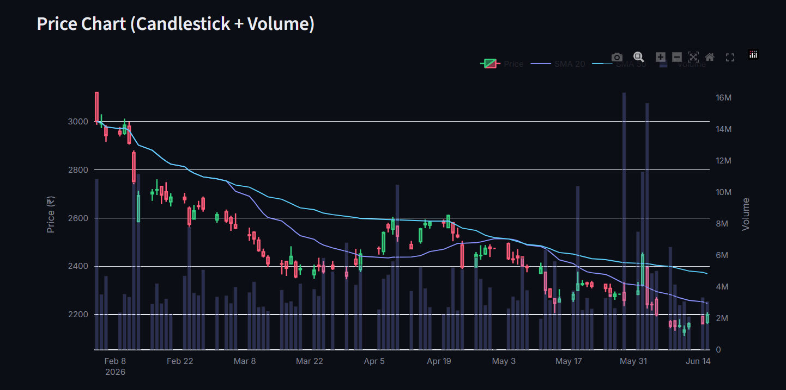
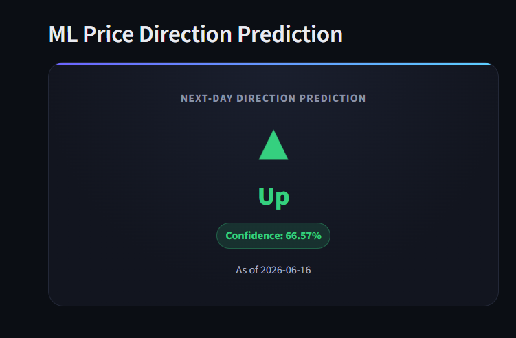
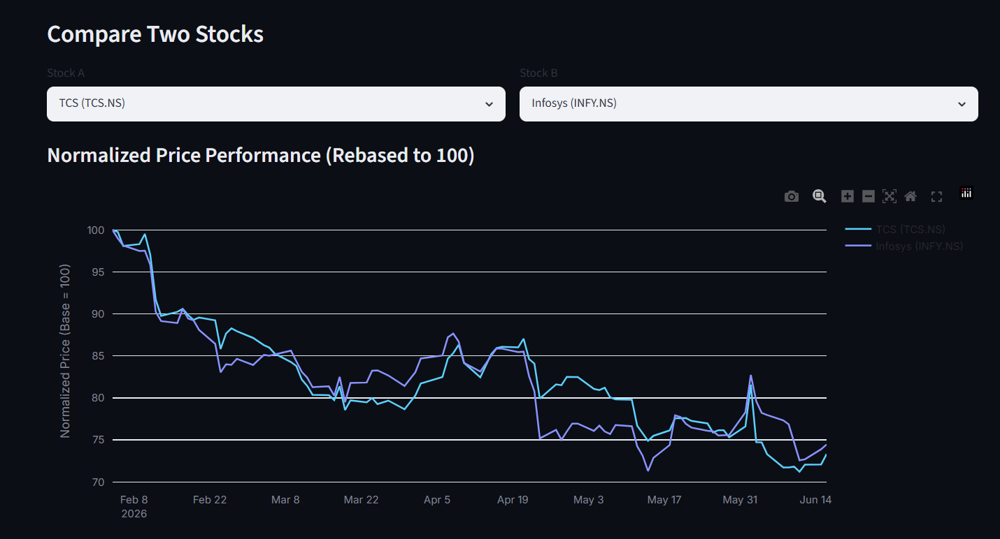

# 📈 Real-Time Stock Market Intelligence Platform

A full-stack data analytics platform that fetches real-time and historical
stock data for 10 major Indian companies, calculates technical indicators,
analyzes financial news sentiment using Claude AI, predicts next-day price
direction with an XGBoost model, and presents everything through a
FastAPI backend and a premium Streamlit dashboard.

---

## Badges


---

## 🏗️ Architecture

```
                         ┌─────────────────────────┐
                         │   yfinance (market data) │
                         │   NewsAPI (headlines)     │
                         └────────────┬─────────────┘
                                       │
                  ┌────────────────────┴────────────────────┐
                  │                                          │
        ┌─────────▼──────────┐                  ┌───────────▼───────────┐
        │  data_pipeline.py    │                  │  news_sentiment.py     │
        │  - Fetch OHLCV       │                  │  - Fetch headlines     │
        │  - Compute SMA/RSI/  │                  │  - Claude AI sentiment │
        │    MACD/Bollinger    │                  │    scoring (JSON)      │
        │  - APScheduler 30min │                  │  - Daily aggregation   │
        └─────────┬───────────┘                  └───────────┬────────────┘
                  │                                          │
                  └────────────────┬─────────────────────────┘
                                    │
                          ┌─────────▼──────────┐
                          │     PostgreSQL       │
                          │  stock_prices         │
                          │  stock_indicators     │
                          │  news_sentiment_raw   │
                          │  news_sentiment_daily │
                          │  latest_quotes        │
                          │  price_alerts         │
                          └─────────┬─────────────┘
                                    │
                          ┌─────────▼──────────┐
                          │    ml_model.py       │
                          │  - Feature engineering│
                          │  - XGBoost training   │
                          │  - MLflow tracking    │
                          │  - joblib model export│
                          └─────────┬─────────────┘
                                    │
                          ┌─────────▼──────────┐
                          │      api.py          │
                          │  FastAPI backend      │
                          │  - REST endpoints     │
                          │  - API key auth       │
                          │  - CORS enabled       │
                          │  - Loads ML model     │
                          └─────────┬─────────────┘
                                    │ HTTP/JSON
                          ┌─────────▼──────────┐
                          │      app.py           │
                          │  Streamlit dashboard   │
                          │  - KPI cards           │
                          │  - Plotly charts       │
                          │  - News sentiment table│
                          │  - ML prediction card  │
                          │  - Stock comparison    │
                          └────────────────────────┘
```

---

## 🚀 Tech Stack

| Layer              | Technology                                  |
|--------------------|----------------------------------------------|
| Data Ingestion     | yfinance, NewsAPI                             |
| AI Sentiment       | Anthropic Claude API (claude-sonnet-4-6)      |
| Database           | PostgreSQL (with SQLite fallback for local dev)|
| Scheduling         | APScheduler                                   |
| ML Model           | XGBoost, scikit-learn, MLflow, joblib         |
| Backend API        | FastAPI, Pydantic, SQLAlchemy                 |
| Frontend Dashboard | Streamlit, Plotly                             |
| Containerization   | Docker, docker-compose                        |
| CI/CD              | GitHub Actions                                |
| Deployment         | Render.com                                    |

---

## 📂 Project Structure

```
.
├── data_pipeline.py          # Phase 1: data fetching + indicators + scheduler
├── news_sentiment.py         # Phase 2: NewsAPI + Claude sentiment analysis
├── ml_model.py                # Phase 2: XGBoost training + MLflow + predict()
├── api.py                     # Phase 3: FastAPI backend
├── app.py                     # Phase 4: Streamlit dashboard
├── requirements.txt           # All Python dependencies (Phases 1-4)
├── Dockerfile.api              # Docker image for FastAPI backend
├── Dockerfile.streamlit        # Docker image for Streamlit dashboard
├── docker-compose.yml          # Orchestrates Postgres + API + Dashboard
├── .env.example                # Environment variable template
├── test_basic.py                # Smoke tests for CI
├── models/                      # Saved ML model artifacts (joblib)
└── .github/workflows/deploy.yml # CI/CD pipeline
```

---

## ⚙️ Local Setup (without Docker)

```bash
# 1. Clone the repository
git clone https://github.com/<your-username>/stock-intelligence-platform.git
cd stock-intelligence-platform

# 2. Create a virtual environment
python -m venv venv
source venv/bin/activate     # Windows: venv\Scripts\activate

# 3. Install dependencies
pip install -r requirements.txt

# 4. Configure environment variables
cp .env.example .env
# Edit .env and fill in your NEWSAPI_KEY, ANTHROPIC_API_KEY, API_KEY, etc.

# 5. Run the data pipeline once to populate the database
python data_pipeline.py --once

# 6. (Optional) Fetch news sentiment
python news_sentiment.py

# 7. Train the ML model
python ml_model.py train

# 8. Start the FastAPI backend
uvicorn api:app --reload --host 0.0.0.0 --port 8000

# 9. In a new terminal, start the Streamlit dashboard
streamlit run app.py
```

Visit:
- API docs: http://localhost:8000/docs
- Dashboard: http://localhost:8501

---

## 🐳 Running with Docker Compose

```bash
# 1. Configure environment variables
cp .env.example .env
# Edit .env with your real values

# 2. Build and start all services
docker compose up --build

# 3. (First time only) run the pipeline + train the model inside the API container
docker compose exec api python data_pipeline.py --once
docker compose exec api python news_sentiment.py
docker compose exec api python ml_model.py train

# 4. Restart the API so it picks up the newly trained model
docker compose restart api
```

Services will be available at:
- FastAPI: http://localhost:8000/docs
- Streamlit: http://localhost:8501
- PostgreSQL: localhost:5432

To stop everything:
```bash
docker compose down
```

To stop and remove the database volume (fresh start):
```bash
docker compose down -v
```

---

## ☁️ Deploying to Render.com (Free Tier)

Render's free tier supports Docker-based **Web Services** and a free
**PostgreSQL** database (90-day limit on free Postgres, after which you
can upgrade or recreate it).

### Step 1 — Push your code to GitHub

```bash
git init
git add .
git commit -m "Initial commit - Stock Intelligence Platform"
git branch -M main
git remote add origin https://github.com/<your-username>/stock-intelligence-platform.git
git push -u origin main
```

### Step 2 — Create a PostgreSQL database on Render

1. Go to https://dashboard.render.com → **New** → **PostgreSQL**.
2. Name it (e.g. `stock-db`), choose the **Free** plan, and click **Create Database**.
3. Once created, copy the **Internal Database URL** and the individual
   connection fields (host, port, database, user, password) from the
   database's **Info** page — you'll need these for env variables below.

### Step 3 — Create the FastAPI backend Web Service

1. **New** → **Web Service** → connect your GitHub repo.
2. Settings:
   - **Name**: `stock-api`
   - **Runtime**: Docker
   - **Dockerfile Path**: `Dockerfile.api`
   - **Docker Context**: `.`
   - **Plan**: Free
3. Add environment variables (Settings → Environment):
   ```
   PG_HOST=<from Render Postgres internal host>
   PG_PORT=5432
   PG_DB=<your db name>
   PG_USER=<your db user>
   PG_PASSWORD=<your db password>
   API_KEY=<a long random secret>
   ALLOWED_ORIGINS=*
   ANTHROPIC_API_KEY=<your Anthropic key>
   NEWSAPI_KEY=<your NewsAPI key>
   ```
4. Click **Create Web Service**. Render will build the Docker image and
   deploy it. Note the public URL (e.g. `https://stock-api.onrender.com`).
5. Copy the **Deploy Hook** URL from Settings → save it as a GitHub
   secret named `RENDER_DEPLOY_HOOK_API` (Repo → Settings → Secrets →
   Actions).

### Step 4 — Create the Streamlit dashboard Web Service

1. **New** → **Web Service** → same GitHub repo.
2. Settings:
   - **Name**: `stock-dashboard`
   - **Runtime**: Docker
   - **Dockerfile Path**: `Dockerfile.streamlit`
   - **Docker Context**: `.`
   - **Plan**: Free
3. Environment variables:
   ```
   API_BASE_URL=https://stock-api.onrender.com
   API_KEY=<same secret as above>
   ```
4. Click **Create Web Service**.
5. Copy its **Deploy Hook** URL → save as GitHub secret
   `RENDER_DEPLOY_HOOK_STREAMLIT`.

### Step 5 — Run the pipeline & train the model on Render

Render's free Web Services don't support long-running background jobs
or one-off shell access on the free tier easily, so for a portfolio
project the simplest approach is:

1. Run `data_pipeline.py --once`, `news_sentiment.py`, and
   `ml_model.py train` **locally** (pointed at your Render Postgres
   using its **External Database URL**), which populates the database
   and produces the `models/` artifacts.
2. Commit the resulting `models/` folder to your repo (or re-run step
   3's deploy after committing) so the API container has the trained
   model on startup.
3. Optionally, set up a free cron job (e.g. via
   [cron-job.org](https://cron-job.org) or GitHub Actions on a
   schedule) that calls a dedicated `/refresh` endpoint you add to
   `api.py`, which triggers `data_pipeline.run_pipeline()`.

### Step 6 — Verify

- Backend health check: `https://stock-api.onrender.com/health`
- Swagger docs: `https://stock-api.onrender.com/docs`
- Dashboard: `https://stock-dashboard.onrender.com`

> ⚠️ Free Render services spin down after periods of inactivity and may
> take ~30-60 seconds to "wake up" on the first request.

---

## 🔄 CI/CD Pipeline

Every push to `main` triggers `.github/workflows/deploy.yml`, which:

1. **Tests** — installs dependencies and runs `pytest test_basic.py`.
2. **Builds** — builds both Docker images to confirm they compile
   correctly.
3. **Deploys** — calls Render's Deploy Hooks for both the API and
   dashboard services, triggering a fresh deploy from the latest `main`.

Required GitHub repo secrets:
| Secret name                     | Description                          |
|----------------------------------|---------------------------------------|
| `RENDER_DEPLOY_HOOK_API`          | Deploy hook URL for the FastAPI service |
| `RENDER_DEPLOY_HOOK_STREAMLIT`    | Deploy hook URL for the Streamlit service |

---

## 📊 Screenshots

| Overview Tab | ML Insights Tab |
|---|---|
|  |  |

| Compare Stocks Tab |
|---|
|  |

---

## 🌐 Live Demo

- **Dashboard**: [https://stock-dashboard-pocy.onrender.com](https://stock-dashboard-pocy.onrender.com)
- **API Docs**: [https://stock-api-dws4.onrender.com/docs](https://stock-api-dws4.onrender.com/docs)

> ⚠️ Hosted on Render's free tier — the first request after a period of inactivity may take 30-60 seconds to wake up the service.

---

## 📌 Stocks Tracked

TCS, Infosys, Reliance Industries, HDFC Bank, Wipro, ICICI Bank,
HCL Technologies, Bajaj Finance, Asian Paints, Maruti Suzuki.

---

## 📄 License

This project is licensed under the MIT License — feel free to use it as
a reference for your own portfolio projects.
